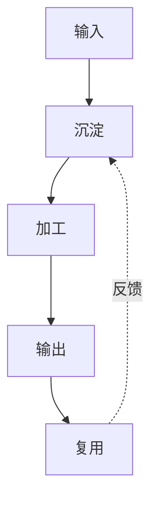

---
cssclasses:
  - morandi-showcase
tags:
  - 莫兰迪
  - 知识管理
---

# 第一步：了解知识库结构

你的知识库遵循「输入 → 沉淀 → 加工 → 输出 → 复用」的流动闭环。每一层只承担一种主要职责，让信息保持安静、清晰并且可追溯。



| 层级 | 功能 | 关键词 |
| --- | --- | --- |
| 输入层 | 捕获一切灵感和信息 | 记录、收藏 |
| 沉淀层 | 建立永久记忆 | 人脉、公司、工具 |
| 加工层 | 组织与提炼内容 | 项目、分析、连接 |
| 输出层 | 形成可以发布的结果 | 文章、报告、分享 |

## 第二步：记录第一条笔记

> [!info] 处理流程
> 用户输入 → 意图识别 → 任务分类 → 执行 → 结果回写。

> [!tip] 关键优势
> - 语义检索：通过自然语言描述找到相关笔记
> - 自动整理：根据内容建立双向链接
> - 知识图谱：可视化展示笔记间的关系

### Markdown 元素

普通文字保持舒适的行高，==重要内容使用低饱和高亮==，内部链接显示为 [[知识整理]]，行内代码显示为 `const focus = true`。

```javascript
const knowledgeFlow = ["输入", "沉淀", "加工", "输出", "复用"];
console.log(knowledgeFlow.join(" → "));
```

- [x] 建立收集箱
- [x] 创建项目目录
- [ ] 整理第一批永久笔记
- [ ] 输出第一篇主题文章

---

> [!quote] 今日提醒
> 温柔、克制、耐看。让思考在宁静中沉淀。
